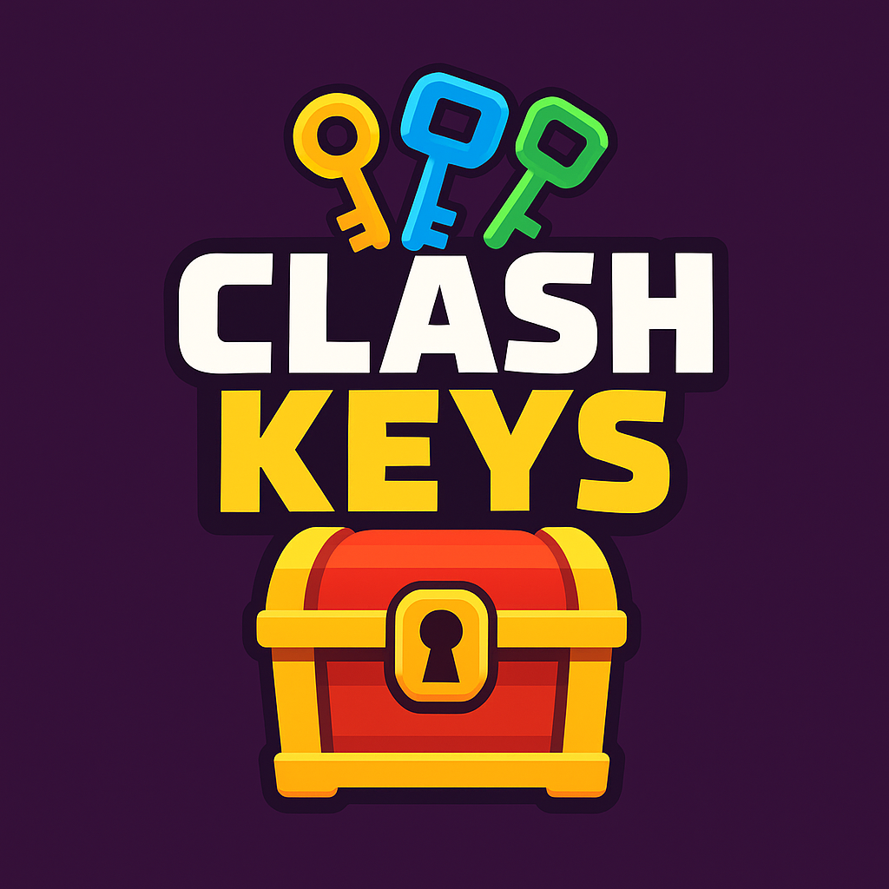
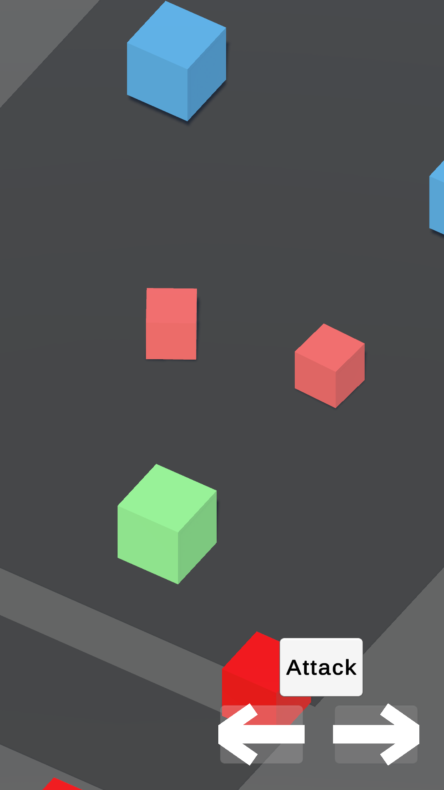
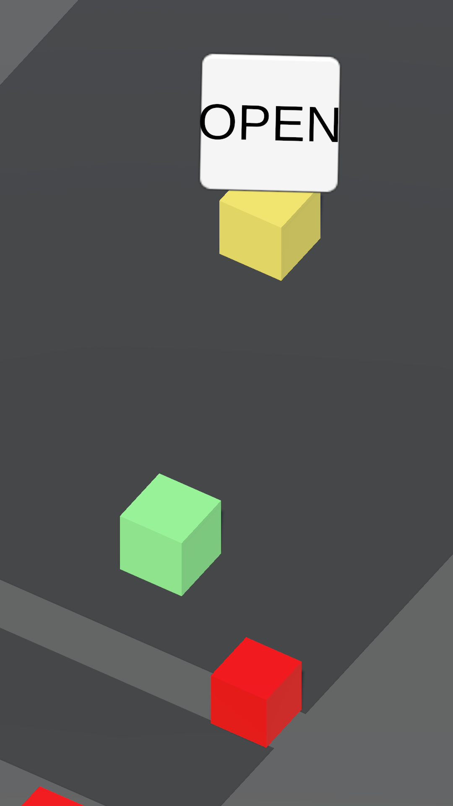

  

# Clash Keys

_Cross, fight, unlock treasure!_

---

## How to Run

1. Clone the repository
2. Open and Run *Assets/_ClashKeys/Scenes/Main.unity* scene

## Description

A small arcade game where the player's goal is to safely guide the character across three roads with moving obstacles
and defeat enemies in the final arena.

Features:

- The character spawns at the starting point and must cross three roads with varying obstacle speed and density.
- Colliding with an obstacle respawns the player at the start.
- After crossing the roads, the player fights two enemies. Both victory and defeat are possible.
- Upon victory, enemies disappear and a chest appears.
- The chest can be opened with a mini‑game: drag three matching keys into the lock.
- When the correct keys are placed, the victory screen appears with a message and a restart button.

## Reference

- [Crossy Road](https://play.google.com/store/apps/details?id=com.yodo1.crossyroad)
- [Escalators](https://play.google.com/store/apps/details?id=io.blackcandy.escalators&hl=en_US&gl=US)

## Screenshots

|  |  |  |  
|---|---|---|  

## Gameplay Video

  Made with ❤️ by Gexetr

